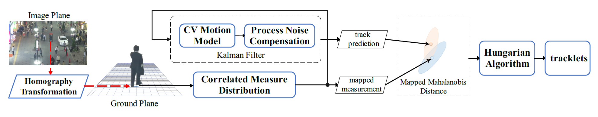
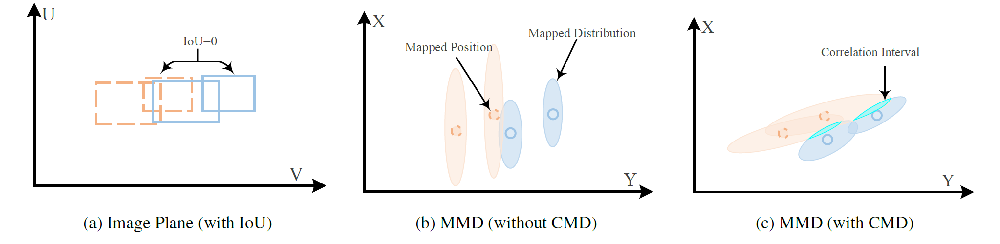

# UCMCTrack

[](https://arxiv.org/abs/2312.08952) [](https://paperswithcode.com/sota/multi-object-tracking-on-mot17?p=ucmctrack-multi-object-tracking-with-uniform)

**[AAAI 2024] UCMCTrack: Multi-Object Tracking with Uniform Camera Motion Compensation**

UCMCTrack is a simple pure motion based tracker that achieves state-of-the-art performance on multiple datasets. In particular, it achieves the first place on MOT17 (IDF1, HOTA) without using any appearance cues, making it highly applicable for real-time object tracking on end devices.



**The pipeline of the proposed UCMCTrack.** First, the detection boxes are mapped onto the ground plane using homography transformation. Subsequently, the Correlated Measurement Distribution (CMD) of the target is computed. This distribution is then fed into a Kalman filter equipped with the Constant Velocity (CV) motion model and Process Noise Compensation (PNC). Next, the mapped measurement and the predicted track state are utilized as inputs to compute the Mapped Mahalanobis Distance (MMD). Finally, the Hungarian algorithm is applied to associate the mapped measurements with tracklets, thereby obtaining complete tracklets.




**Visualization of distance measures.** (a) Visualization of IoU on the image plane. IoU fails as there is no intersection between bounding boxes. (b) Visualization of Mapped Mahalanobis Distance (MMD) without Correlated Measurement Distribution (CMD). Incorrect associations occur due to insufficient utilization of distribution information. (c) Visualization of MMD with CMD. Correct associations after using the correlated probability distribution, undergoing a rotation on the ground plane.

## Benchmark Performance

[](https://paperswithcode.com/sota/multi-object-tracking-on-mot17?p=ucmctrack-multi-object-tracking-with-uniform)

| Dataset    | HOTA | AssA | IDF1 | MOTA | FP     | FN     | IDs   | Frag  |
| ---------- | ---- | ---- | ---- | ---- | ------ | ------ | ----- | ----- |
| MOT17 test | 65.5 | 66.4 | 80.9 | 80.1 | 34,584 | 75,846 | 1,647 | 2,298 |
| MOT20 test | 62.7 | 63.3 | 77.3 | 75.4 | 27,794 | 98,207 | 1,295 | 1,395 |

*This result was obtained using the Python version of the code. In the paper, the C++ version of the code was used, and the Python version had slightly lower performance metrics than the C++ version (due to some subtle differences in implementation). We will address this issue in the future.*

## Get Started

- Install the required dependency packages 

```bash
pip install -r requirements.txt
```

- Run UCMCTrack on the MOT17 test dataset, and the tracking results are saved in the folder `output/mot17/test`

```bash
. run_mot17_test.bat
```

- Run UCMCTrack on the MOT17 validation dataset and evaluate performance metrics such as IDF1, HOTA, and MOTA locally

```bash
. run_mot17_val.bat
```

- Run UCMCTrack on the MOT20 test dataset, and the tracking results are saved in the folder `output/mot20/test`

```bash
. run_mot20_test.bat
```

## Demo


## Roadmap

We are continuously updating UCMCTrack and warmly welcome contributions to enhance its value for the community. Our current high-priority tasks are as follows:

- [x] Release code for replicating results on MOT17 dataset.

- [x] Release code for replicating results on MOT20 dataset.

- [ ] Implement a demo of UCMCTrack based on YOLOv8.

- [ ] Release code for estimating camera parameters from a single picture.

- [ ] Release code for replicating results on DanceTrack dataset.

- [ ] Release code for replicating results on Kitti dataset.

  

## Estimated Camera Parameters

This directory provides camera parameters we have estimated:

└─cam_para
    ├─DanceTrack
    ├─MOT17
    └─MOT20

We have provided the camera parameter files estimated on the datasets MOT17, MOT20 and DanceTrack. The specific format of the camera parameter file consists of following three parts. Among them, $IntrinsicMatrix$ represents the intrinsic parameters Ki of the camera, the first and second columns represent the focal lengths of the camera in the x and y directions, and the third column is the offset when the origin of the physical imaging plane moves to the pixel plane. $RotationMatrices$ and $TranslationVectors$ represent key components of the camera’s extrinsic parameters Ko. Among them, $RotationMatrices$ represents the rotation of the camera relative to the ground plane, while $TranslationVectors$ represents the offset of the camera relative to the ground plane, in millimeters.

#### Sample

$RotationMatrices$
0.00000 -1.00000 0.00000
-0.05234 0.00000 -0.99863
0.99863 0.00000 -0.05234

$TranslationVectors$
0 1391 3968 

$IntrinsicMatrix$
1213 0 960 
0 1213 540 
0 0 1 


## Acknowledgement and Citation

```bibtex
@inproceedings{yi2024ucmc,
  title={UCMCTrack: Multi-Object Tracking with Uniform Camera Motion Compensation},
  author={Kefu Yi, Kai Luo, Xiaolei Luo, Jiangui Huang, Hao Wu, Rongdong Hu, Wei Hao},
  booktitle={AAAI},
  year={2024}
}
```

